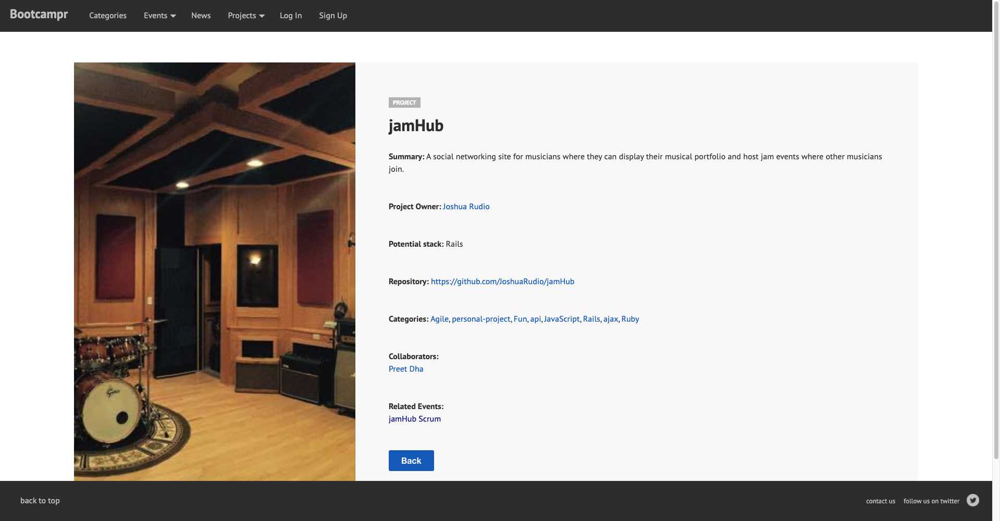
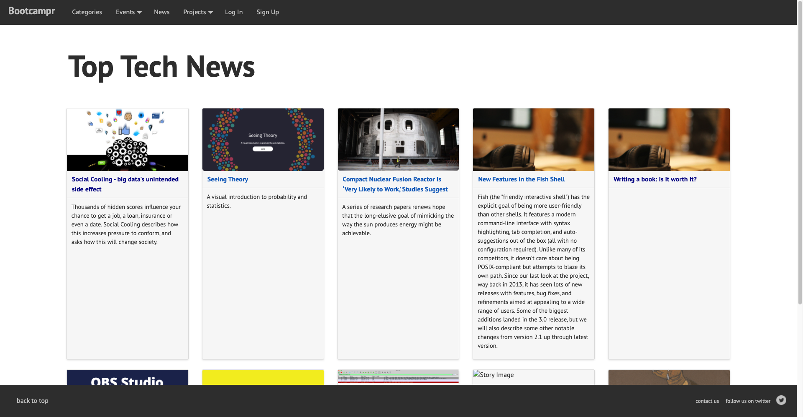
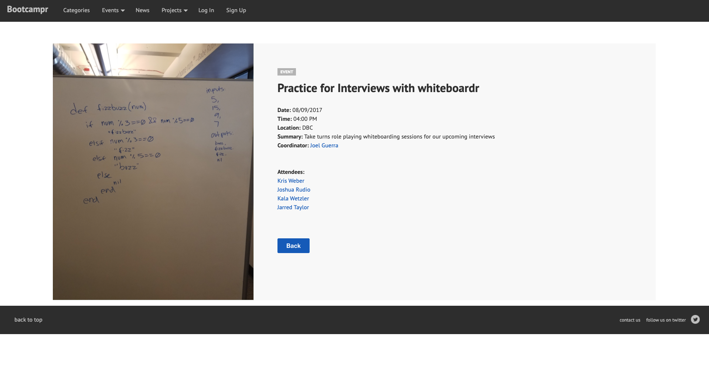

  
  
  

Bootcampr was created to keep the spirit of Dev Bootcamp alive. I had the privilege of being one of the last cohorts to graduate from Dev Bootcamp before they closed their doors. 

Obtaining the technical 'know how' at a coding academy is a given, but at Dev Bootcamp, we were taught as engineers that communication within an organization is as important as proper implementation. We were taught that soft-skills can help one excel in any environment. In school, we were given a safe space to fail without falling under harsh scrutiny.

Our goal with Bootcampr was to do the same. We wanted to provide a place for fellow coding bootcamp graduates to connect and collaborate on their own projects. For this project, I was on a team of 4 and were given a short time span to deliver a complete web application that included several API integrations. I was responsible for configuring our project with OAuth sign up functionality via GitHub, some front end design, and writing a proper test suite.

The app is hosted on Heroku.

You can check it out [here!](http://www.bootcampr.herokuapp.com).
